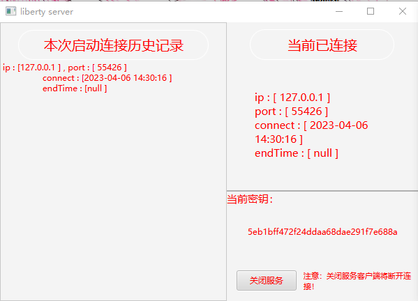

# liberty-remote
## 介绍
liberty是一款远程控制桌面的桌面应用软件。

我们将为您提供一款免费开源的 点对点的远程控制软件，

我们不会收集任何关于您的信息，

我们尽可能的维护您信息的安全性，但如果发生了信息泄露，或是遭到攻击，

我们不负任何责任！请悉知。

## 软件界面
### 环境
* java : jdk 11+
* maven

可以根据自己的需求进行不同平台的打包 windows，mac

### 服务端

### 客户端

## 注：
* 由于某些原因，该软件暂时只做了基础功能，实际使用网络io的问题比较严重，导致了画面逐帧显示。
* 网络请求事件并没有做限制（上面原因的根本问题），导致了请求被延迟加载，画面割裂。
* 部分小问题还未来得及修复。
* ui样式只做了一部分
* 如有兴趣，可以根据自己的需求进行定制。

优化思路：
> 主要核心原因是：网络请求单线程（目前）
> 
> 只需要将单线程分割成多个线程，图片加载线程结合事件线程，将任务进行分步进行，
> 对并发高的进行 请求分流/限流
> 
> 项目主框架是 netty 所以不必过分考虑 开多线程会不会导致服务端请求性能降低，
> 但是要注意存在的请求不应过多（长连接），可能会导致本地tcp连接堆积（严重）
> 
> 目前的安全校验比较简单，采用服务端-客户端 密钥一致 的方式保证连接安全，可以根据自己的需求定制
> 
> 如果有什么问题，可以联系我

# 联系我
QQ: 2513266093

email : 2513266093@qq.com

 